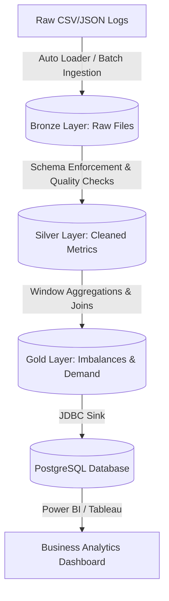

# 🚀 Energy Generation & Consumption ETL Pipeline

A high-throughput, scalable Data Engineering pipeline built using **Scala, Apache Spark, and Databricks** to process and analyze historical hourly energy metrics. It follows the **Medallion Lakehouse Architecture** to ingest raw files, perform transactional schema validation, aggregate metrics, and load results into **PostgreSQL** for operational dashboards.

---

## 📐 Architecture Workflow



### 🏆 Medallion Layer Details
1. **Bronze Layer (Raw):** Ingests raw hourly consumption and generation CSV files directly. Preserves raw fields and metadata (ingestion timestamp, source file name).
2. **Silver Layer (Cleaned):**
   - Standardizes timestamp formats (`yyyy-MM-dd HH:mm:ss`).
   - Filters out null records, negative energy values, and out-of-bound ranges.
   - Enforces strict schemas and catalogs datasets using **Unity Catalog**.
3. **Gold Layer (Aggregated):**
   - Joins hourly generation vs. demand logs.
   - Computes supply imbalances: `Imbalance = Generation - Consumption`.
   - Computes rolling metrics (e.g., peak demand hours per region).

---

## 🛠️ Tech Stack & Key Concepts
- **Compute Engine:** Apache Spark Core & Spark SQL (Scala API)
- **Lakehouse Platform:** Databricks Workspace & Clusters
- **Storage Layer:** Delta Lake (for ACID transactions, time-travel, and schema enforcement)
- **Metadata Governance:** Unity Catalog (data access control, column-level security)
- **Target Sink:** PostgreSQL RDBMS (via JDBC connection)
- **Container / Execution Environment:** Linux Bash scripting for cron schedules

---

## 💻 Core Code Implementations

### 1. Spark Ingestion & Ingest Tracking
Below is the Scala implementation of the Silver layer clean-up and Schema validation:

```scala
import org.apache.spark.sql.functions._
import org.apache.spark.sql.types._
import org.apache.spark.sql.SaveMode

// Define Schema for Raw Energy Metrics
val energySchema = new StructType()
  .add("timestamp", StringType, nullable = false)
  .add("region_id", IntegerType, nullable = false)
  .add("generation_kwh", DoubleType, nullable = true)
  .add("consumption_kwh", DoubleType, nullable = true)

// Load Bronze Data
val rawDf = spark.read
  .schema(energySchema)
  .option("header", "true")
  .csv("/mnt/bronze/energy_raw/*.csv")

// Clean & Add Metadata (Silver transformation)
val cleanedDf = rawDf
  .withColumn("timestamp", to_timestamp(col("timestamp"), "yyyy-MM-dd HH:mm:ss"))
  .withColumn("generation_kwh", coalesce(col("generation_kwh"), lit(0.0)))
  .withColumn("consumption_kwh", coalesce(col("consumption_kwh"), lit(0.0)))
  .withColumn("ingestion_time", current_timestamp())
  .filter(col("generation_kwh") >= 0.0 && col("consumption_kwh") >= 0.0)

// Write to Delta Lake Silver Table
cleanedDf.write
  .format("delta")
  .mode(SaveMode.Append)
  .option("mergeSchema", "true")
  .save("/mnt/silver/energy_clean")
```

### 2. Gold Imbalance Aggregations
Calculating supply-demand discrepancies using SQL Window functions in Databricks Spark SQL:

```sql
-- Databricks SQL Gold Aggregation Query
CREATE OR REPLACE TABLE gold_energy_imbalances AS
SELECT 
    region_id,
    date_trunc('HOUR', timestamp) as hour_bucket,
    SUM(generation_kwh) as total_generation,
    SUM(consumption_kwh) as total_consumption,
    (SUM(generation_kwh) - SUM(consumption_kwh)) as energy_imbalance_kwh,
    CASE 
        WHEN (SUM(generation_kwh) - SUM(consumption_kwh)) < 0 THEN 'DEFICIT'
        ELSE 'SURPLUS'
    END as grid_status
FROM 
    delta.`/mnt/silver/energy_clean`
GROUP BY 
    region_id, 
    date_trunc('HOUR', timestamp)
ORDER BY 
    hour_bucket DESC;
```

---

## 📈 Performance & Lakehouse Optimizations
To speed up analytical queries on PostgreSQL and Delta tables, the following optimizations were applied:
1. **Delta Lake Z-Ordering:** Co-locating data in storage by clustering on `region_id` and `timestamp` columns to perform data skipping on filter queries:
   ```sql
   OPTIMIZE delta.`/mnt/silver/energy_clean` ZORDER BY (region_id, timestamp);
   ```
2. **Delta Lake Vacuuming:** Cleaning up stale commits and files older than 7 days to manage storage footprint and cost:
   ```sql
   VACUUM delta.`/mnt/silver/energy_clean` RETAIN 168 HOURS;
   ```
3. **Partitioning:** Partitioned final table structures by `year_month` (e.g. `2026-07`) to eliminate full scans during periodic reports.

---

## 🚀 How to Run the Pipeline

### Prerequisites
- Databricks Runtime 13.x+ (includes Spark 3.4+, Scala 2.12+)
- Access permissions to Unity Catalog
- PostgreSQL connection details

### Running inside Databricks Notebook
1. Mount the raw ADLS/S3 directory containing metrics logs to `/mnt/bronze/`.
2. Import the notebook `notebooks/Energy_ETL_Pipeline.scala`.
3. Configure JDBC credentials in the Secrets manager.
4. Execute the cells sequentially, or configure a **Databricks Workflows Job** to trigger the execution daily at `01:00 UTC`.
